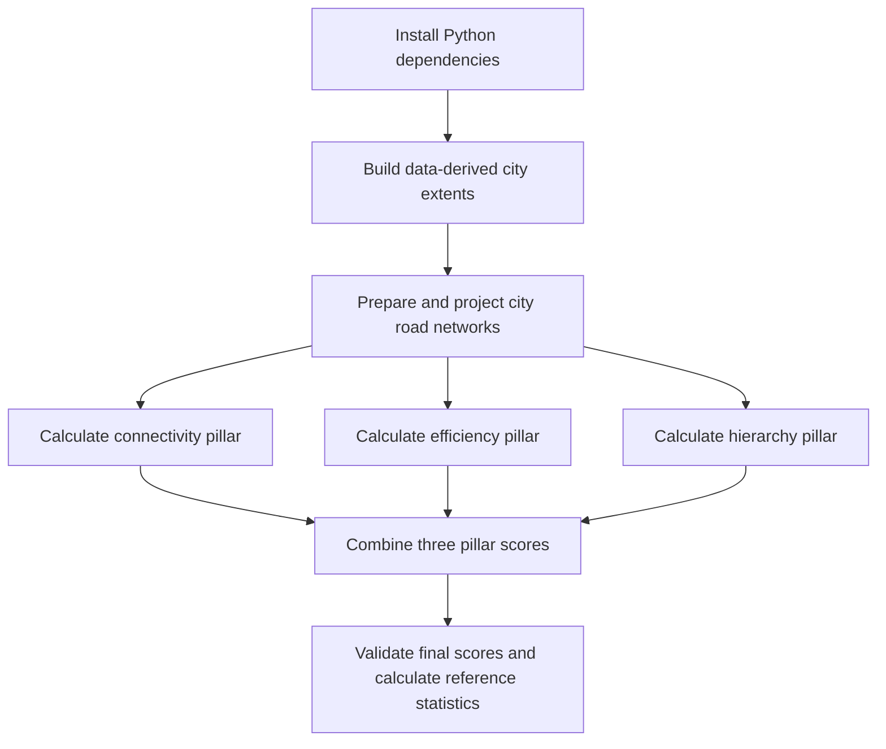

# Road Network Quality Index (RNQI)

This repository contains the analysis pipeline for calculating and comparing the **Road Network Quality Index (RNQI)** across five benchmark cities in India: **Chandigarh, Jaipur, Pune, Kolkata, and Ranipet**.

RNQI summarizes road-network performance through three equally weighted pillars:

- **Connectivity** — network connectedness and access-related graph measures.
- **Efficiency** — measures of how efficiently locations can be reached through the network.
- **Hierarchy** — measures describing the structure and organization of the road network.

The pipeline prepares city study areas and road-network data, calculates each pillar, combines the normalized pillar scores into a composite city score, and writes validation and reference statistics. The implementation is in [`RoadNetworkOutputs/Final_Code/`](RoadNetworkOutputs/Final_Code/).

## Pipeline flow



The default runner executes these stages in order:

| Order | Script | Purpose |
|---|---|---|
| Setup | `01_requirements.txt` | Installs the Python packages required by the pipeline. |
| 1 | `02_build_urban_core_from_geofabrik.py` | Uses building-footprint coverage on a regular grid to derive city extents. The city center helps identify or validate the target urban component; it is not used to create a fixed-radius study area. |
| 2 | `03_rnqi_data.py` | Loads city boundaries and road-network inputs, preprocesses and projects the graphs, and prepares network data for scoring. |
| 3 | `04_rnqi_connectivity.py` | Calculates and normalizes connectivity measures into the connectivity pillar score. |
| 4 | `05_rnqi_efficiency.py` | Calculates and normalizes efficiency measures into the efficiency pillar score. |
| 5 | `08_rnqi_hierarchy.py` | Calculates and normalizes hierarchy measures into the hierarchy pillar score. |
| 6 | `06_rnqi_final.py` | Validates the three pillar scores and calculates the final RNQI composite. |
| Post-processing | `00_run_all.py` | Calculates reference-city classifications and summary statistics after the final score is produced. |

For each city, the final composite is calculated as the arithmetic mean of the three normalized pillar scores:

**RNQI = (Connectivity + Efficiency + Hierarchy) / 3**

The final scoring script also calculates a reference range using the mean and population standard deviation of the five benchmark-city RNQI scores.

## Run the full pipeline

You need Python with `pip`. From the repository root:

```bash
cd RoadNetworkOutputs/Final_Code
python 00_run_all.py
```

The full run installs packages from `01_requirements.txt`, builds city extents, runs the scoring stages, and writes the final results. Efficiency and hierarchy calculations can take substantial time. Some stages may also rely on network data or external OSM sources, depending on which input files are available.

The city-extent builder processes Geofabrik PBF data using the **osmium** command-line utility. It is not installed by the Python requirements file. On macOS, install it with:

```bash
brew install osmium-tool
```

Make sure the regional PBF inputs expected by the builder are available before running the extent-generation stage. OpenStreetMap data is subject to its applicable attribution and ODbL requirements.

## Run from a later stage

To skip dependency installation and city-extent generation and begin at stage 4 (efficiency):

```bash
python 00_run_all.py --from-step 4
```

The runner accepts `--from-step` values from `2` to `6`. Starting at stage 2 performs setup and extent generation. Starting later skips those steps; the required input data and outputs from earlier stages must already exist. For stages 3 and later, the runner checks that the five city extents and projected graphs are readable before continuing.

## Inputs and outputs

The project data and generated artifacts are organized under `RoadNetworkOutputs/Final_Code/`:

- `data/osm/` — city-level OSM extracts and related road/building input data.
- `data/raw/` — raw city road-network graphs.
- `data/processed/` — intermediate processed network data generated by the pipeline.
- `outputs/boundaries/` — administrative boundaries and data-derived city extents.
- `outputs/graphs/`, `outputs/nodes/`, and `outputs/edges/` — projected graphs and network representations generated during processing.
- `outputs/metadata/` — per-pillar scores, final RNQI scores, validation files, and reference statistics.

Key final files include:

- `outputs/metadata/final_rnqi_scores.csv` — city pillar scores and composite RNQI.
- `outputs/metadata/final_rnqi_validation.csv` — checks for score ranges and composite arithmetic.
- `outputs/metadata/final_rnqi_reference_range.csv` — reference mean and population-standard-deviation range.
- `outputs/metadata/final_rnqi_reference_statistics.csv` and `final_rnqi_reference_classification.csv` — summary statistics and city tier assignments written by the master runner.

The pipeline may create or refresh files under `data/` and `outputs/` when it runs. Keep a backup of any local inputs or results that should not be overwritten.

## Other scripts

`07_city_rnqi_evaluator.py` provides a separate city-evaluation workflow. `03_rnqi_connectivity_new.py` is not part of the default sequence wired into `00_run_all.py`; the default runner uses `04_rnqi_connectivity.py` for connectivity scoring.

## Repository layout

```text
RoadNetworkOutputs/
└── Final_Code/
    ├── 00_run_all.py
    ├── 01_requirements.txt
    ├── 02_build_urban_core_from_geofabrik.py
    ├── 03_rnqi_data.py
    ├── 04_rnqi_connectivity.py
    ├── 05_rnqi_efficiency.py
    ├── 06_rnqi_final.py
    ├── 07_city_rnqi_evaluator.py
    ├── 08_rnqi_hierarchy.py
    ├── data/
    ├── outputs/
    └── rnqi/
```
